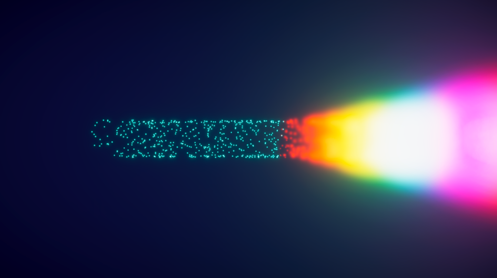
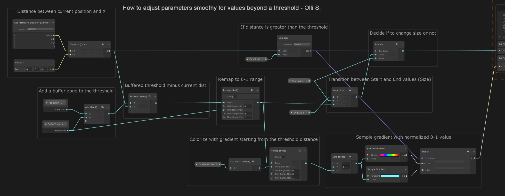

# VisualEffectGraphChangeValuesSmoothlyBeyondaThreshold

Here's a sort of tiny Visual Effect Graph tutorial on how to smoothly change values beyond a set threshold value. This could be done in different dimensions too.

Below is a graph shot that shows the critical parts of how to do this. The current particle's distance is measured, then it's compared to a threshold value. Fading is done within a buffer zone, the changing values inside this buffer zone are remapped to 0-1 range, so that they can be easily made to drive a lerp that changes the value gradually. This might not be the best way to do it, but it works and might be useful for some situations.

